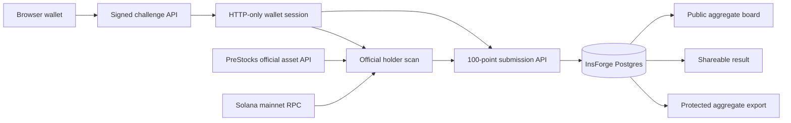

# PreStocks Radar

**Which private company should PreStocks tokenize next?** PreStocks Radar is a wallet-verified community demand board. A Solana wallet signs a one-time message, receives exactly 100 equal signal points, allocates them among curated company candidates, and publishes one short reason. The public board shows real aggregate demand and a holder/community split. This is research, not governance or a listing commitment.

[Live product](https://6764jzr4.insforge.site) · [Source repository](https://github.com/abhigyan1102/PreStocks)

## Product flow

1. Anyone can view the public demand board without a wallet.
2. A compatible Solana wallet connects and signs an expiring challenge. The server checks the Ed25519 signature against the wallet address, consumes the nonce, and sets an HTTP-only session cookie. No transaction, private key, or seed phrase is requested.
3. The existing official PreStocks API and Solana scanner check current exact-mint holdings across SPL Token and Token-2022. This gives a visible holder or community label, with **no extra points**.
4. The wallet allocates exactly 100 integer points among active text-only candidates and gives one reason of at most 220 characters. A second submission replaces the first atomically; one wallet has one current allocation.
5. The board counts current submissions, points, allocating wallets, holder/community segments, and recent reasons. A stable `/signal/:id` link shows the wallet's latest shareable result without exposing its address or balances.

A signature proves control of an address, **not** unique-person identity. Holder status is checked when a signal is published; a later token transfer does not change a prior submission's segment until that wallet republishes. “Signed participants” on the board means wallets with a current published submission. It does not count everyone who merely signed in.

## Candidate registry

The initial curated list is Stripe, Databricks, Canva, Discord, Epic Games, Perplexity, Ramp, and Vercel. Candidate records are text-only. They contain no token contracts or unofficial mints and do not imply company or PreStocks endorsement. Before launch, the list was compared with the [current official PreStocks asset registry](https://prestocks.com/api/prestocks); the submission route checks that registry again before accepting a signal. Candidate activity and descriptions are controlled in the versioned InsForge migration. Review company status and official overlap when changing the list.

## Architecture



The schema is in `migrations/20260922185638_prestocks-radar.sql`: candidates, challenges, sessions, submissions, and allocations. Tables have RLS enabled and no direct `anon` or `authenticated` access. Next.js route handlers use the InsForge admin SDK on the server. The database function `radar_replace_submission` validates active candidates and an exact 100-point sum, then replaces a wallet's allocation in one transaction. `radar_board` aggregates points and wallet counts without returning addresses. The export requires `RADAR_EXPORT_TOKEN` as an `Authorization: Bearer` header and returns aggregate JSON or `?format=csv`; it does not return wallet-level data. CSV cells are escaped for spreadsheet safety.

The old ActionKit SDK, React components, and REST routes remain in the repository for reuse. The previous production state is preserved by the `actionkit-production-final` git tag. ActionKit is no longer the homepage product. `/demo/integration` redirects to `/`.

## Local development

Requires Node.js 22 or later and a linked InsForge project. The CLI is invoked through `npx -y @insforge/cli`.

```bash
npm install
cp .env.example .env.local
# Set SOLANA_RPC_URL, INSFORGE_URL, INSFORGE_API_KEY, and RADAR_EXPORT_TOKEN.
npm run dev
```

Open `http://127.0.0.1:3000`. The board requires InsForge and the official registry. Signing and publishing additionally require a compatible wallet and a working Solana mainnet RPC. All credential values are server-only. Keep `.env.local` and `.insforge/project.json` out of commits. On macOS when this checkout is inside Documents, npm scripts store dependencies and `.next` output under `~/Library/Caches/PreStocksActionKit/` to avoid cloud eviction.

## API

| Route | Purpose |
| --- | --- |
| `GET /api/radar/board` | Public aggregate demand and a bounded set of recent reasons |
| `POST /api/radar/challenge` | Create an expiring wallet message |
| `POST /api/radar/verify` | Verify exact signed bytes, consume nonce, start session |
| `GET /api/radar/me` | Current session, live holder label, own current allocation |
| `POST /api/radar/submit` | Recheck holder, validate 100 points, replace current allocation |
| `POST /api/radar/logout` | Revoke the current session |
| `GET /api/radar/result/:id` | Address-free shareable result projection |
| `GET /api/radar/export` | Bearer-protected aggregate JSON or CSV |

All mutating routes require a same-origin browser request. Public reads and authentication responses use `Cache-Control: no-store`. The older `/api/v1/*` ActionKit routes still exist; they are not part of the Radar user flow.

## Verification

```bash
npm test
npm run typecheck
npm run build
npm audit --omit=dev
```

`npm test` covers signature validity, wrong key, expiry, reuse, malformed input, exact 100-point validation, candidate checks, and the inherited exact-mint/SPL/Token-2022 holder scanner. `RADAR_LIVE_TEST=1 node scripts/radar-live-smoke.mjs` exercises the live challenge, one-wallet replacement, aggregate board, share result, and protected export using a generated test wallet; it deletes the synthetic submission, session, and challenge at the end. Do not interpret a generated test identity as user traction.

## Limits

This MVP does not prevent one person from controlling multiple wallets. The holder segment is a snapshot at publish time. The public board contains user-written reasons without automated moderation; keep them short and avoid putting private information there. Candidate companies are not associated with or endorsed by this project. Radar has no trading, token rewards, predictions, or listing guarantees.
