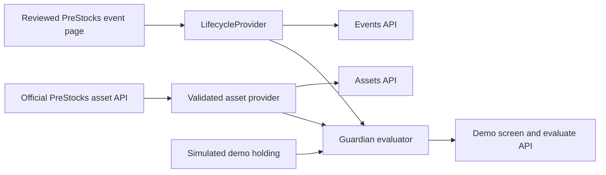

# PreStocks Guardian

Guardian turns PreStocks lifecycle notices into sourced, machine-readable events and evaluates what they mean for a token holding. The current dashboard is a demonstration client for that engine.

## Current status

This repository contains the first working slice: official PreStocks asset ingestion, a reviewed SpaceX lifecycle event, the Guardian evaluator, read-only asset and event routes, a simulation-only evaluation route, and a labeled demo screen. It does **not** yet scan a real wallet, connect Phantom or Backpack, send webhooks, provide an SDK, or execute a swap. The demo balances are illustrative. No private key is requested.

The [official PreStocks API](https://prestocks.com/api/prestocks) supplies asset identity, Solana mint addresses, token price, mark price, valuation, and supply; the server revalidates the response every 60 seconds. The [SpaceX product page](https://prestocks.com/spacex) supplies the reviewed IPO and swap notice. Guardian stores that notice as a temporary source snapshot with `sourceUrl` and `verifiedAt`; it is not a live PreStocks corporate-action feed. It should be rechecked before real users rely on an action status.

The xAI page describes a deadline of September 12, 2026, which has passed as of this work. xAI is also absent from the current official asset API response, so it is not used as an active demo holding.

## Run locally

Requires Node.js 22 or later.

```bash
npm install
npm run dev
```

Open `http://localhost:3000`. Run `npm test`, `npm run typecheck`, and `npm run build` to verify the current slice.

## API today

| Route | Purpose |
| --- | --- |
| `GET /api/v1/assets` | Current official asset data plus neutral premium calculation |
| `GET /api/v1/events` | Reviewed lifecycle snapshots and provenance |
| `GET /api/v1/events/SPACEX` | Reviewed events for one symbol |
| `POST /api/v1/evaluate` | Run the engine on an explicitly simulated balance |

Example simulation request:

```bash
curl -sS -X POST http://localhost:3000/api/v1/evaluate \
  -H 'Content-Type: application/json' \
  -d '{"symbol":"SPACEX","simulatedBalance":12.4}'
```

The response includes `mode: "simulation"` and `holding.simulated: true`. This endpoint does not imply that a wallet owns the tokens. The planned `GET /api/v1/wallet/:address/actions` route will require live Solana token-account lookup and mint matching before it can make a wallet-specific claim.

## Architecture



The `LifecycleProvider` interface isolates event acquisition from decision logic. An official PreStocks corporate-action source can replace the static provider without changing the evaluator. The evaluator matches events to assets by both symbol and mint, and uses UTC deadlines to expire actions. Missing event coverage is displayed as “No recorded event” in the UI; it is not proof that no corporate action exists.

## Next implementation gates

1. Add a server-side Solana wallet scanner that resolves token accounts by official mint, validates addresses, handles token decimals exactly, and returns wallet-specific actions. Confirm an RPC endpoint and test against a wallet with known PreStocks holdings.
2. Add explicit event freshness and editorial re-verification before any action is presented as current beyond the demo.
3. Publish a small TypeScript SDK against the stable API response schemas.
4. Add webhook subscriptions only after authentication, delivery retries, and idempotency are designed and tested.
5. Add a real wallet connection and end-to-end proof. Until then, every balance on the site remains clearly simulated.

This tool provides information, not investment advice. PreStocks tokens provide economic exposure under PreStocks' terms; Guardian does not represent ownership of the underlying company.
