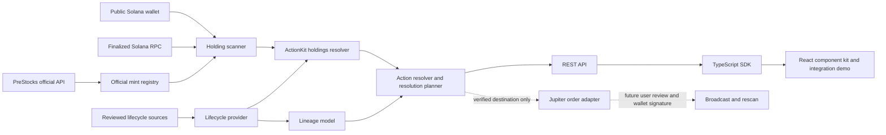

# PreStocks ActionKit

**A read-only integration that adds official PreStocks asset identity, live wallet holdings, normalized position actions, and sourced lifecycle context to a Solana application.**

[Live demo](https://6764jzr4.insforge.site) · [Developer integration](https://6764jzr4.insforge.site/#developers) · [GitHub repository](https://github.com/abhigyan1102/PreStocks)

Generic Solana wallets can show that a token exists, but they do not know whether it is an official PreStocks asset, whether a lifecycle event affects it, or what the holder should review next. ActionKit combines the official mint registry, finalized Solana mainnet balances, reviewed lifecycle sources, and deterministic server-side decisions behind REST, TypeScript SDK, and React interfaces.

## Judge quickstart

1. Open the [production homepage](https://6764jzr4.insforge.site).
2. Paste the public mainnet example `6GJbPKBtovsrMEEMcic5KMi5tswh9qSyT5ZYLMqEwNgt` into **Check your public wallet**.
3. Confirm five official PreStocks positions, open **SpaceX**, and select **See next step**.
4. Observe `ACTION_REQUIRED` and the fail-closed `MANUAL_ACTION_REQUIRED` plan: the source notice is reviewed, while the destination mint and executable route remain unverified.
5. Open [Developer integration](https://6764jzr4.insforge.site/#developers) for the generic-wallet before state, one-component integration, PreStocks-aware after state, and React, SDK, and REST examples.

The canonical experience is `/`. The former `/demo/integration` path permanently redirects to `/#developers`.

## Production proof

| Classification | Evidence | Current result |
| --- | --- | --- |
| **LIVE** | Production deployment | [6764jzr4.insforge.site](https://6764jzr4.insforge.site) |
| **LIVE** | Public mainnet holder | 17 token accounts; five exact-mint PreStocks positions |
| **LIVE** | SpaceX position | `ACTION_REQUIRED` |
| **REVIEWED SOURCE** | PreStocks SpaceX product-page notice | Stored with source URL and review timestamp |
| **LIVE + DERIVED** | Wallet-specific resolution plan | `MANUAL_ACTION_REQUIRED` |
| **SYNTHETIC TEST** | Demo balances and multi-step lineage fixtures | Used only for deterministic UI and test coverage |
| **UNVERIFIED** | Destination mint, conversion ratio, executable route | Not claimed and left unavailable |

The holder is a public onchain example. This project does not identify its owner or claim control of it. The application is deployed through the linked InsForge project using its Vercel hosting provider. Production has one required server-side environment variable, `SOLANA_RPC_URL`. `JUPITER_API_KEY` is intentionally absent because no reviewed transition currently has a verified destination mint. No secret is exposed to the browser or stored in this repository.

Quick production checks:

```bash
curl https://6764jzr4.insforge.site/api/v1/assets
curl https://6764jzr4.insforge.site/api/v1/lineage/SPACEX
curl https://6764jzr4.insforge.site/api/v1/wallet/6GJbPKBtovsrMEEMcic5KMi5tswh9qSyT5ZYLMqEwNgt/actions
curl -X POST https://6764jzr4.insforge.site/api/v1/resolve/plan \
  -H 'content-type: application/json' \
  -d '{"wallet":"6GJbPKBtovsrMEEMcic5KMi5tswh9qSyT5ZYLMqEwNgt","symbol":"SPACEX"}'
```

## What works today

- The [official PreStocks API](https://prestocks.com/api/prestocks) supplies asset identity and `contract_address` values. These exact mint addresses are the trusted registry; token symbols and metadata are never used to identify holdings. The server revalidates asset data every 60 seconds.
- A public-address lookup reads finalized SPL Token and Token-2022 accounts from a configured Solana mainnet RPC, validates parsed data, ignores zero balances and unknown mints, deduplicates accounts, and aggregates same-mint raw amounts using integers. The response marks these positions `mode: "live"`.
- `GET /api/v1/wallet/:address/actions` is the first ActionKit integration surface. It combines the trusted mint registry, live wallet balances, current market data, and normalized actions with explicit source metadata. An informational action and an executable onchain action are separate states.
- A reviewed [SpaceX product-page notice](https://prestocks.com/spacex) is stored as a sourced lifecycle snapshot. The evaluator selects the relevant event deterministically, prioritizing active required actions over historical notices. ActionKit exposes an official review action and a non-executable migration requirement because no verified destination mint exists.
- The lifecycle provider declares its acquisition mode and source class. The current provider is a reviewed static snapshot, not a PreStocks corporate-actions API. The lineage model retains event provenance and can describe verified transitions. The production registry currently contains **one** SpaceX notice and no verified destination mint or conversion ratio. Its lineage cannot claim an XAI → SPACEX → SPCXx chain.
- The deterministic resolution planner separates current action from historical lineage. Announced and completed events are informational, expired events stay historical, issuer flows remain issuer-managed, and swap candidates require independently verified execution evidence for the exact source mint, destination mint, and raw amount.
- A typed TypeScript SDK and four reusable React components consume the same REST routes. The developer section at `/#developers` shows the change from a balance-only wallet UI to sourced lifecycle actions and provides React, SDK, and REST integration paths.
- A Jupiter order adapter and quote validation boundary are present. They only run after a reviewed transition supplies a verified destination mint and `JUPITER_API_KEY` is configured. No such production transition is recorded yet, so **no executable Jupiter route is currently claimed**. The API does not expose an unsigned transaction for signing.
- The demo wallet and simulation API remain separate and clearly labeled. Demo balances do not establish real ownership.

No private key, seed phrase, custody, automatic signing, transaction broadcast, or swap execution is part of this release. A wallet connection and signed transaction flow are not enabled.

## Run locally

Requires Node.js 22 or later.

```bash
npm install
cp .env.example .env.local
# Set SOLANA_RPC_URL to a trusted Solana mainnet HTTPS RPC endpoint.
npm run dev
```

Open `http://localhost:3000`. The homepage and demo work without RPC configuration. Live wallet routes return a clear configuration error until `SOLANA_RPC_URL` is set; they never silently use devnet. `JUPITER_API_KEY` is optional and is only used if a reviewed transition later supplies an executable candidate pair. Keep both values server-side in `.env.local`; never commit a key.

Open `http://localhost:3000/#developers` for the reusable wallet integration proof. The previous `/demo/integration` URL redirects to this canonical section.

On macOS when the checkout is inside Documents, npm scripts place `node_modules` and generated `.next` output in `~/Library/Caches/PreStocksActionKit/` to avoid cloud eviction during local runs. The dev server listens on `127.0.0.1:3000` and uses Next.js Webpack mode because the dependency symlink is outside the project. Stop `npm run dev` before `npm run build`, as both use the same `.next` output.

```bash
npm test
npm run typecheck
npm run build
npm audit --omit=dev
```

## API

| Route | Meaning |
| --- | --- |
| `GET /api/v1/assets` | Official asset registry and neutral premium calculation |
| `GET /api/v1/events` | Reviewed lifecycle snapshots with provenance |
| `GET /api/v1/events/:symbol` | Reviewed events for a symbol |
| `GET /api/v1/lineage/:symbol` | Sourced transitions; historical entries explicitly marked |
| `GET /api/v1/wallet/:address/prestocks` | Live official PreStocks holdings with exact balances |
| `GET /api/v1/wallet/:address/actions` | Flagship ActionKit response with holdings, market data, and normalized sourced actions |
| `GET /api/v1/wallet/:address/continuity` | Live wallet positions and lifecycle states |
| `POST /api/v1/resolve/plan` | Wallet-specific, derived next-step plan |
| `POST /api/v1/resolve/quote` | Jupiter route check only for a verified source/destination pair |
| `POST /api/v1/evaluate` | Explicitly simulated balance evaluation |

The live continuity response includes `positions` with exact `rawBalance` strings, `decimals`, fixed-decimal `uiBalance` strings, `lifecycleState`, evaluations, and counts. Empty wallets return empty positions and zero counts. The plan route accepts `{"wallet":"<public address>","symbol":"SPACEX"}`. Its present SpaceX result is `MANUAL_ACTION_REQUIRED`: the notice is sourced, but no destination mint or onchain route is verified. `NO_ACTION_REQUIRED` means no action is recorded in the reviewed provider; it is **not** proof that no real-world event exists. `RESOLVED` must not be inferred from a completed notice; it requires future wallet-level proof.

The quote route accepts the same body. It cannot return `EXECUTABLE` unless the plan has a verified destination, Jupiter returns a current order for the exact source mint, destination mint, amount and wallet, and the returned unsigned transaction decodes and requires that wallet's signature. A missing key is a configuration state, not evidence that no route exists. A route may disappear or a quote may go stale before signing. No signing or broadcast endpoint is exposed.

Invalid wallet addresses return 400. Missing RPC configuration returns 503, RPC rate limits 429, and RPC failures or malformed account data 502. Live responses use `Cache-Control: no-store`. The RPC provider can observe queried public addresses; choose one whose privacy practices suit the deployment.

## TypeScript SDK

The repository SDK is exported from `sdk/index.ts` and accepts an optional `baseUrl` and `fetch` implementation.

```ts
import { PreStocksActionKit } from "./sdk";

const kit = new PreStocksActionKit({ baseUrl: "https://your-actionkit-host.example" });
const assets = await kit.assets.list();
const positionActions = await kit.wallet.getActions(publicKey);
```

Available methods:

- `assets.list()` and `assets.get(symbol)`
- `wallet.getHoldings(wallet)` and `wallet.getActions(wallet)`
- `lifecycle.getLineage(symbol)`
- `resolve.plan({ wallet, symbol })`

Failed HTTP responses throw `ActionKitRequestError` with the response status and parsed payload. The SDK does not add client-side lifecycle or execution decisions.

## React components

The reusable components are exported from `components/actionkit/index.ts`:

```tsx
import { PreStocksActions } from "./components/actionkit";

export function WalletPreStocks({ publicKey }: { publicKey: string }) {
  return <PreStocksActions wallet={publicKey} />;
}
```

- `PreStocksPortfolio` renders official holdings.
- `PreStocksActions` renders normalized actions and their provenance.
- `PreStocksPosition` renders one already-loaded action position.
- `PreStocksContinuity` renders sourced lineage for a symbol.

Loading, empty, error, and populated states are built into the data-fetching components. They call the SDK instead of duplicating server decision logic.

## Architecture



The `LifecycleProvider` keeps source acquisition separate from decision logic. A future official corporate-action feed can replace the static snapshot without replacing the evaluator. Every transition carries its source URL, name, and verification time. Unknown destinations, ratios, and execution modes remain `null` or `UNKNOWN`; expired events remain historical and cannot become active actions through input ordering.

## Source and provenance model

- **LIVE** data is fetched at request time from the official PreStocks asset API or finalized Solana mainnet RPC.
- **REVIEWED SOURCE** data is a versioned lifecycle snapshot with its source URL, source name, and review timestamp. It is not presented as a live corporate-actions feed.
- **DERIVED** states are deterministic ActionKit evaluations built from a live position and reviewed source facts.
- **SYNTHETIC TEST** data is limited to labeled demo balances and automated fixtures. It is never presented as wallet ownership.
- **UNVERIFIED** facts remain `null`, `UNKNOWN`, or unavailable. They cannot produce an executable action.

## Production verification

Verified on 20 September 2026 against Solana mainnet through the configured production RPC:

- `GET /api/v1/assets` returned 200 with eight assets from `PRESTOCKS_OFFICIAL_API`.
- The public onchain wallet `6GJbPKBtovsrMEEMcic5KMi5tswh9qSyT5ZYLMqEwNgt` had 17 token accounts across SPL Token and Token-2022. ActionKit returned 200 with five exact-mint PreStocks positions: ANDURIL, FIGUREAI, NEURALINK, OPENAI, and SPACEX.
- `GET /api/v1/wallet/:address/actions` returned sourced market actions plus one SpaceX `ACTION_REQUIRED` lifecycle state. `POST /api/v1/resolve/plan` returned 200 with `MANUAL_ACTION_REQUIRED`, no destination mint, and no claimed executable route.
- A newly generated public key with zero token accounts returned 200 and an empty position list. A malformed address returned 400, a valid wallet without the requested position returned 404, and an unknown symbol returned 400.
- `GET /api/v1/lineage/SPACEX` returned 200 with provider mode `reviewed-static`, the source URL, and the verification timestamp.
- The homepage was checked at 1440 × 900 and 390 × 844 with no horizontal document overflow or browser console errors.

The holder example was discovered from public mint-filtered token-account data. It proves that the production scanner recognizes live onchain holdings; it does not identify the wallet owner or prove that anyone participating in this project controls that wallet.

## Testing

The release gate covers 60 deterministic tests for exact-mint matching, SPL Token and Token-2022 scanning, integer balance aggregation, lifecycle selection, provenance validation, resolution planning, execution evidence, SDK behavior, and React states. The current production-ready revision passes:

```bash
npm test
npm run typecheck
npm run build
npm audit --omit=dev
```

Production is also checked at 1440 × 900 and 390 × 844 for the public-holder flow, developer tabs, copy behavior, anchors, external sources, console errors, and horizontal overflow.

## Remaining proof before a full Continuity flow

1. Reverify event freshness and obtain sourced destination mints, conversion details, and issuer instructions. The current SpaceX snapshot alone cannot establish an executable route.
2. With a verified pair and Jupiter API key, test a real current quote. A quote is not an executed swap.
3. Add wallet review and explicit signing, broadcast, confirmation, then a wallet rescan before any position is called `RESOLVED`. No signed transaction has been tested here.
4. Add historical replay only after a complete xAI transition is sourced in the repository. Test fixtures for multi-step lineage are synthetic and are not public historical claims.

PreStocks tokens provide economic exposure under PreStocks' terms. Continuity does not represent ownership of the underlying company or provide investment advice.
