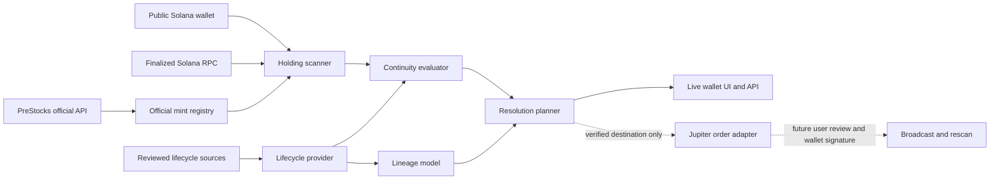

# PreStocks Continuity

PreStocks Continuity turns private-company lifecycle events into wallet-aware, verifiable Solana actions. **When the company changes, your onchain position changes with it.**

Tokenized private-company positions do not remain static when the underlying company is acquired, merges, or goes public. Continuity connects reviewed lifecycle events to actual wallet holdings and determines the next supported step. An event source establishes **what changed**. An execution router separately establishes **whether an onchain route exists now**. Neither fact implies the other.

## What works today

- The [official PreStocks API](https://prestocks.com/api/prestocks) supplies asset identity and `contract_address` values. These exact mint addresses are the trusted registry; token symbols and metadata are never used to identify holdings. The server revalidates asset data every 60 seconds.
- A public-address lookup reads finalized SPL Token and Token-2022 accounts from a configured Solana mainnet RPC, validates parsed data, ignores zero balances and unknown mints, deduplicates accounts, and aggregates same-mint raw amounts using integers. The response marks these positions `mode: "live"`.
- A reviewed [SpaceX product-page notice](https://prestocks.com/spacex) is stored as a sourced lifecycle snapshot. The evaluator selects the relevant event deterministically, prioritizing active required actions over historical notices. The planner currently points SpaceX holders to the official instructions.
- The lineage model retains event provenance and can describe verified transitions. The production registry currently contains **one** SpaceX notice and no verified destination mint or conversion ratio. Its lineage cannot claim an XAI → SPACEX → SPCXx chain.
- A Jupiter order adapter and quote validation boundary are present. They only run after a reviewed transition supplies a verified destination mint and `JUPITER_API_KEY` is configured. No such production transition is recorded yet, so **no executable Jupiter route is currently claimed**. The API does not expose an unsigned transaction for signing.
- The demo wallet and simulation API remain separate and clearly labeled. Demo balances do not establish real ownership.

No private key, seed phrase, custody, automatic signing, transaction broadcast, or swap execution is part of this release. A wallet connection and signed transaction flow are not enabled.

## Run locally

Requires Node.js 22 or later.

```bash
npm install
cp .env.example .env.local
# Set SOLANA_RPC_URL to a trusted Solana mainnet HTTPS RPC endpoint.
npm run dev
```

Open `http://localhost:3000`. The homepage and demo work without RPC configuration. Live wallet routes return a clear configuration error until `SOLANA_RPC_URL` is set; they never silently use devnet. `JUPITER_API_KEY` is optional and is only used if a reviewed transition later supplies an executable candidate pair. Keep both values server-side in `.env.local`; never commit a key.

On macOS when the checkout is inside Documents, npm scripts place `node_modules` and generated `.next` output in `~/Library/Caches/PreStocksGuardian/` to avoid cloud eviction during local runs. The dev server listens on `127.0.0.1:3000` and uses Next.js Webpack mode because the dependency symlink is outside the project. Stop `npm run dev` before `npm run build`, as both use the same `.next` output.

```bash
npm test
npm run typecheck
npm run build
npm audit --omit=dev
```

## API

| Route | Meaning |
| --- | --- |
| `GET /api/v1/assets` | Official asset registry and neutral premium calculation |
| `GET /api/v1/events` | Reviewed lifecycle snapshots with provenance |
| `GET /api/v1/events/:symbol` | Reviewed events for a symbol |
| `GET /api/v1/lineage/:symbol` | Sourced transitions; historical entries explicitly marked |
| `GET /api/v1/wallet/:address/continuity` | Live wallet positions and lifecycle states |
| `POST /api/v1/resolve/plan` | Wallet-specific, derived next-step plan |
| `POST /api/v1/resolve/quote` | Jupiter route check only for a verified source/destination pair |
| `POST /api/v1/evaluate` | Explicitly simulated balance evaluation |
| `GET /api/v1/wallet/:address/actions` | Earlier Guardian response, retained for compatibility |

The live continuity response includes `positions` with exact `rawBalance` strings, `decimals`, fixed-decimal `uiBalance` strings, `lifecycleState`, evaluations, and counts. Empty wallets return empty positions and zero counts. The plan route accepts `{"wallet":"<public address>","symbol":"SPACEX"}`. Its present SpaceX result is `MANUAL_ACTION_REQUIRED`: the notice is sourced, but no destination mint or onchain route is verified. `NO_ACTION_REQUIRED` means no action is recorded in the reviewed provider; it is **not** proof that no real-world event exists. `RESOLVED` must not be inferred from a completed notice; it requires future wallet-level proof.

The quote route accepts the same body. It cannot return `EXECUTABLE` unless the plan has a verified destination, Jupiter returns a current order for the exact source mint, destination mint, amount and wallet, and the returned unsigned transaction decodes and requires that wallet's signature. A missing key is a configuration state, not evidence that no route exists. A route may disappear or a quote may go stale before signing. No signing or broadcast endpoint is exposed.

Invalid wallet addresses return 400. Missing RPC configuration returns 503, RPC rate limits 429, and RPC failures or malformed account data 502. Live responses use `Cache-Control: no-store`. The RPC provider can observe queried public addresses; choose one whose privacy practices suit the deployment.

## Architecture



The `LifecycleProvider` keeps source acquisition separate from decision logic. A future official corporate-action feed can replace the static snapshot without replacing the evaluator. Every transition carries its source URL, name, and verification time. Unknown destinations, ratios, and execution modes remain `null` or `UNKNOWN`; expired events remain historical and cannot become active actions through input ordering.

## Remaining proof before a full Continuity flow

1. Configure mainnet RPC and check a known real PreStocks wallet end to end. Unit tests use mocked RPC data and do not prove a live holding.
2. Reverify event freshness and obtain sourced destination mints, conversion details, and issuer instructions. The current SpaceX snapshot alone cannot establish an executable route.
3. With a verified pair and Jupiter API key, test a real current quote. A quote is not an executed swap.
4. Add wallet review and explicit signing, broadcast, confirmation, then a wallet rescan before any position is called `RESOLVED`. No signed transaction has been tested here.
5. Add historical replay only after a complete xAI transition is sourced in the repository. Test fixtures for multi-step lineage are synthetic and are not public historical claims.

PreStocks tokens provide economic exposure under PreStocks' terms. Continuity does not represent ownership of the underlying company or provide investment advice.
